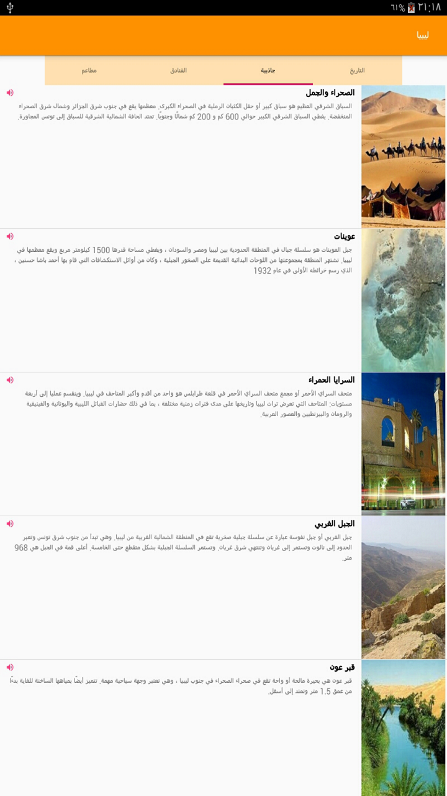

## LibyaApp
The structure of a Libya app which presents relevant information to a user who’s visiting my city
Project which comes under Udacity Android Basics Nanodegree Program .

## Project Overview
The goal is to create a Tour Guide App which presents relevant information to a user who’s visiting your city. The app can list top attractions, restaurants, public places, or events for the city. It can contain all the best known secrets that only locals know. It’s up to you which categories you want to provide, as well as what information to provide in each category.

## What will i learn?
This project is about combining various ideas and skills we’ve been practicing throughout the course. They include:

. Planning your app design and navigation before coding
. Selecting proper data structures to store lists of information
. Building layouts to display those lists of data
. Navigating between lists in Fragments using either a ViewPager plus TabLayout or Navigation Drawer*
  Creating your own custom classes
. Properly handling images or audio (if applicable)

## Requirements
. App contains at least 4 lists of relevant attractions for a location.
. User navigates between lists in Fragments using either a Navigation Drawer or a ViewPager plus TabLayout.
. Each list item contains information about an event, restaurant, historical site, or similar.
. At least one list includes pictures of the location.

## Final Output - Screenshots
English                         | Arabic
:--------------------------------:|:--------------------------------:
  |
  |
  |
  |
  |
  |
  |

# Download
You can download the apk here [LibyaApp](../../raw/master/app/screenshots/app-debug.apk)
